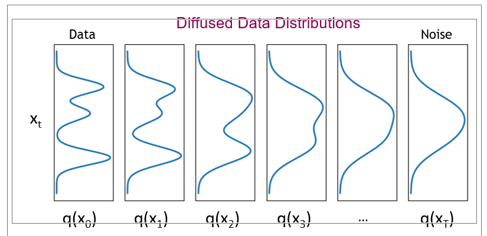
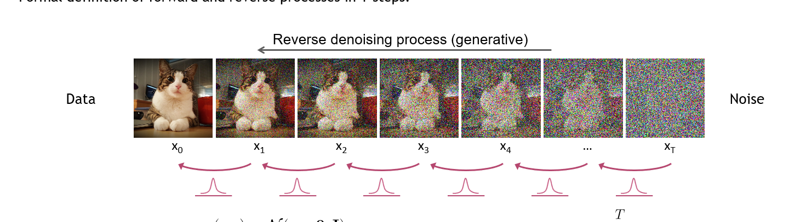
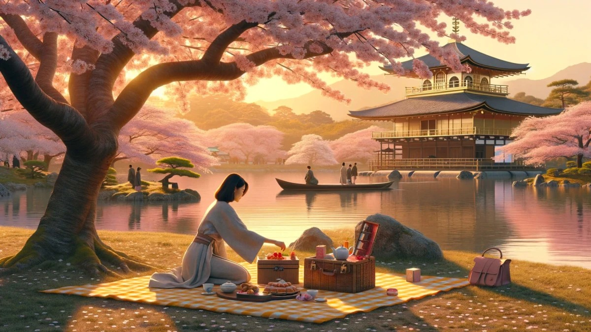
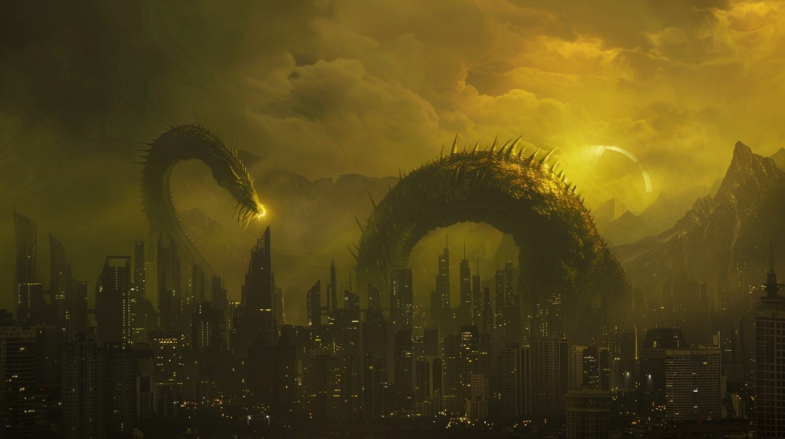

# Diffusion Mechanism

<figure>

<figcaption style="text-align: center">Figure 1: Generation Examples</figcaption>
</figure>

Nowadays generative AI is a very hot topic. Of course in preivious years generative AI was being studied in various works starting from 1970s: [1](https://www.jstor.org/stable/2239727?casa_token=JXT7d48sjqcAAAAA%3A1v-RMEHVDGW_ClpSb1-z91QQczDEKSKMEu6yhb5ec_xxpSgY8jOot2XfEh1MhxMRMKPExyau3vFDL0a2ekW_iRZFvf3TA3tmCKqpq16rTNsYoa-geHZ47Q)[2](https://ieeexplore.ieee.org/document/6302930).  Even tough these foundational research papers are very important and valueable, Generative AI started to be a part of our daily lives especially after [ChatGPT](https://chatgpt.com/) comes out in 2022. The company behind ChatGPT, OpenAI has been working on these technologies beginning from 2015 which is the date when OpenAI is founded. ChatGPT is a generative model in text generation domain. Diffusion models are in image domain on the other hand. 

**What is diffusion ?**

Diffusion is a mechanism where the ultimate goal is to generate the beautiful images you see above. Of course the mechanism is not only used to generate images, with proper formulation diffusion models can approximate any type of data distribution.

Diffusion has two main processes:

* **Forward diffusion:** Gradually adds niose to the input
* **Reverse denoising:** Learns to generate the data with denoising
<figure>

<figcaption style="text-align: center">Figure 2: Diffusion Process Overview</figcaption>
</figure>

   

**Theoretical Backgorund**

You can view diffusion as following. The main goal is to convert complex distribution into a simpler target distribution by means of transition kernel $T$.

$x_0 \sim p_{complex} \to T(x_0)\sim p_{prior}$

**Explanation:** $p_{complex}$ refers to the target data distribution. Which sis referred as complex because the distribution is which we want to learn and be able to generate at the end. $p_{prior} $ refers to the simple distribution or you can wiew it as Gaussian Distribution. This is the distribution we get after applying transition kernel $T$. Below this transition kernel is referred as $q(x|x')$  as well.

This kernels are modeled as repeated actions in diffusion. As you can see from the Figure 2, at each timestep $t_i$ model iteratively denoises the input. Thus at each timestep approaching to the target input distribution. How can we show that mathematically ?

$p_{prior}(x) = \int q(x|x') p_ {prior}(x')dx'$

If transition kernel q has the above property, then repeatedly applying this kernel leads samples towards $p_{prior}$.

<figure>

<figcaption style="text-align: center">Figure 3: Diffusion Over Time</figcaption>
</figure>

However we are able to do this operation in discrete timesteps.

$x_t \sim  q(x|x'= x_{t-1} ), \forall t>0$

*t* is finite and typically sufficent in practive.

Because transition kernel is repeatedly applied we can see overall process as Markov chain.

$q(X_t|X_{t-1}) = N(x_t; \sqrt{1-\beta_t} x_{t-1}, \beta_t I) $

$q(X_T) = p_{prior}(X_T) = N(x_t; 0, I) $

We are doing these iterative operations in order to iteratively denoise the samples. To be able to generate the data, we need reverse diffusion process. 

$x_T \sim N(0,1) \to T^{-1}(x_T) \sim p_{data}$

Process $T^{-1}$ learns from the data. Below you can see a diffusion model that is trained to generate [MNIST data](https://ieeexplore.ieee.org/document/726791).

<figure>

<figcaption style="text-align: center">Figure 4: MNIST dataset Diffusion Example</figcaption>
</figure>

## Forward Diffusion Process

Forward diffusion process is fixed. Starting from data $x_0$, forward diffusion process adds noise to the data with variance $\beta_t$ 

$q(X_t|X_{t-1}) = N(x_t; \sqrt{1-\beta_t} x_{t-1}, \beta_t I) \to q(x_{1:T}|x_0)=\prod_{t=1}q(X_t|x_{t-1})$ 

Using Gaussian's linearity over *t*, we can directly express $q(x_t|x_0)$ as a shortcut. We do not need to sample iteratively in forward process. Thus we can furhter speed up the training process.

Define $ \bar{\alpha_t} = \prod_{s=1}^t(1-\beta_s) \to q(x_t|x_0) = N(x_t;\sqrt{\bar{\alpha}_t}x_0, (1-\bar{\alpha}_t)I))$

Sample: 
$ x_t = \sqrt{\bar{\alpha}_t}x_0+\sqrt{(1-\bar{\alpha}_t)}\epsilon$ where $\epsilon \sim N(0,1)$

Because we can obtain $x_t$ from the $x_0$ the forward process is much faster this way.

 

**How are $\beta_t$ values choosen ?**

There are multiple approaches that one can follow. Some of them are as following:

* Linearly schedule $\beta$ values from $\beta_1=10^{-4}$ to $\beta_T=0.02$ [Denoising Diffusion Probabilistic Models
](https://arxiv.org/abs/2006.11239)
* Learn $\beta$ values together with the model [Sohl-Dickstein, Jascha, et al. "Deep unsupervised learning using nonequilibrium thermodynamics." International conference on machine learning. PMLR, 2015.](https://proceedings.mlr.press/v37/sohl-dickstein15.html).

**What are $\beta$ values and why are they used ?**

Below you may find a couple reasons why $\beta$ values are used and what is the intuition behind it. 

1. **Controlling Noise Addition:**
Forward Process: In the forward process, the diffusion model gradually adds Gaussian noise to an image over several time steps. Beta values, which typically range from a small value near zero to a higher value, determine the variance of the noise added at each step. This gradual increase in noise ensures that the original image is progressively corrupted, eventually turning into pure noise. The sequence of beta values defines the noise schedule, which is critical for training the model to learn how to reverse this process accurately.

2. **Reversing the Diffusion:**
Reverse Process: During the image generation phase, the model learns to reverse the forward process by progressively denoising the noisy image. The beta values again play a role, as they determine how much noise to remove at each step. This controlled removal of noise, guided by the learned parameters from the training phase, allows the model to reconstruct the image from the noise.

3. **Stability and Convergence:**

**Training Stability:** Properly chosen beta values ensure that the diffusion process is stable. If the noise is added too aggressively (large beta values), the model might struggle to learn the reverse process effectively. Conversely, too small beta values might not sufficiently corrupt the image, leading to insufficient training of the reverse process.

**Convergence:** A well-designed noise schedule defined by the beta values helps the model converge more efficiently during training. It ensures that the model can learn to generate high-quality images by balancing the noise addition and removal processes.

4. **Fine-tuning Image Quality:**

Perceptual Quality: The specific pattern and magnitude of beta values can affect the perceptual quality of the generated images. Researchers often experiment with different schedules (e.g., linear, cosine) to find the optimal beta sequence that produces the best visual results

**What happens during forward diffusion process ?**

$q(x_T) = \int q(x_0, x_t) = \int q(x_0) q(x_t | x_0) dx_0$

We can sample $x_t \sim q(x_t)$ by first sampling $x_0 \sim q(x_0)$ and then sampling $x_t \sim q(x_t | x_0)$
q  in the $x_t \sim q(x_t | x_0)$ is the transition kernel. This trick lets us directly making use of $q(x_t | x_0)$ term.

## Backward Diffusion

At this step the main goal is to denoise the $x_t$ so that at each time step we iteratively denoise the $x_t$ a bit. At the end, we will get rid of the noise and reach to original data $x_0$

$p(x_T)=N(x_T;0,I)$

$p_\theta(x_{t-1}|x_t)=N(x_{t-1};\mu_\theta(x_t,t),\sigma^2_t I) \to p_\theta(x_{0:T}) = p(x_T) \prod_{t=1}^Tp_{\theta}(x_{t-1}|x_t)$ 

$\mu_\theta \to$ is a trainable network to estimate $p(x_{t-1}|x_t)$ This can be U-net like model or denoising autoencoder etc. 

! One important point to note is that network is shared across all time steps. So takes *t* (time step) as input as well.

! As you recall $ \bar{\alpha_t}$ is defined as follows.: $ \bar{\alpha_t} = \prod_{s=1}^t(1-\beta_s)$. Because $\beta$ values can be predefined and learned troughout the training, $ \bar{\alpha_t}$ can be fixed or can be learned as well.

# Known diffusion models

There are a lot of diffusion models out there. Denoising diffusion probabilistic models, score based generative models, continuous time diffusion models, latent diffusion models... Below you can see a few examples which are very popular lately.

## DALL-E 3

<figure>

<figcaption style="text-align: center">Figure 5: DALL-E Generated Image</figcaption>
</figure>

Original name of the paper is [
Improving Image Generation with Better Captions
](https://cdn.openai.com/papers/dall-e-3.pdf)

Overview:

DALL-E 3 represents a significant leap in the capabilities of text-to-image models. Building upon the success of its predecessors, DALL-E 3 enhances the quality, coherence, and variety of generated images, offering even more precise and contextually relevant outputs from given text prompts.

Key Improvements:

DALL-E 3 generates higher resolution images with more detail and fewer artifacts compared to DALL-E 2. DALL-E 3 has been trained on a more diverse and extensive dataset, enabling it to generate images across a wider range of subjects and styles.

## Stable Diffusion

<figure>

<figcaption style="text-align: center">Figure 6: Stable Diffusion Generated Image</figcaption>
</figure>

Latest stable diffusion 3 paper: [here](https://stability.ai/news/stable-diffusion-3-research-paper)

Stable Diffusion, developed by Stability AI, is a powerful text-to-image generative model. It operates using Latent Diffusion Models (LDMs), where the diffusion process occurs in a lower-dimensional latent space rather than directly in the pixel space. This method enhances computational efficiency and scalability, enabling the generation of high-resolution images quickly and effectively. Applications range from digital art and design to healthcare and education, making it a versatile tool in various industries. However, challenges such as maintaining image consistency and addressing data biases remain key areas for ongoing research and improvement

## MidJourney

<figure>

<figcaption style="text-align: center">Figure 7: MidJourney Generated Image</figcaption>
</figure>

MidJourney is also a Latent Diffusion Model, however Midjourney is tailored for high-fidelity, artistic image creation, often used by creatives and designers. Stable Diffusion, while also capable of generating high-quality images, is more focused on being a broadly applicable, efficient tool suitable for various applications, including research and commercial use.

