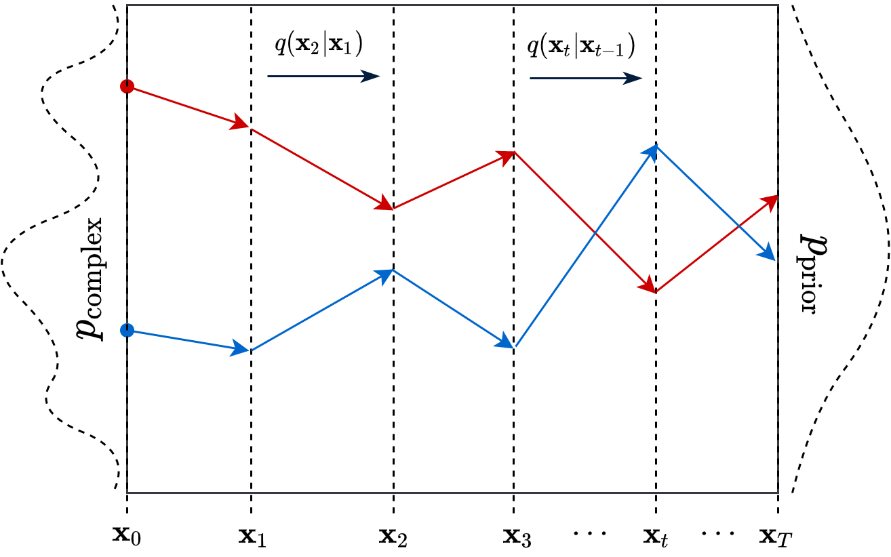
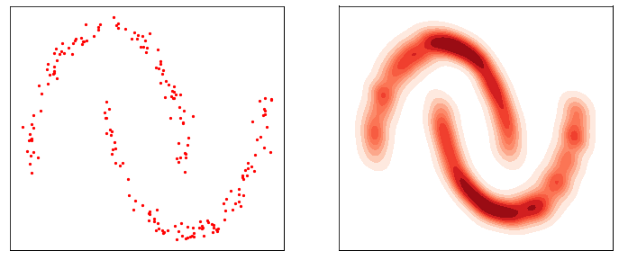
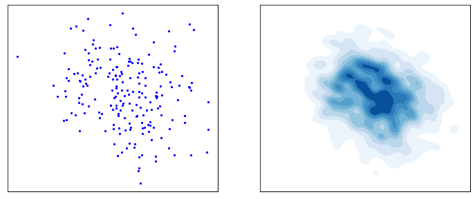

# Diffusion Mechanism

<figure>

<figcaption style="text-align: center">Figure 1: Generation Examples</figcaption>
</figure>

**What is diffusion ?**

Diffusion is a mechanism where the ultimate goal is to generate the beautiful images you see above. Of course the mechanism is not only used to generate images, with proper formulation diffusion models can approximate any type of data distribution.

Diffusion has two main processes:

* **Forward diffusion:** Gradually adds niose to the input
* **Reverse denoising:** Learns to generate the data with denoising
<figure>

<figcaption style="text-align: center">Figure 2: Diffusion Process Overview</figcaption>
</figure>

   

**Theoretical Backgorund**

You can view diffusion as following. The main goal is to convert complex distribution into a simpler target distribution by means of transition kernel T.

x0 ~ pcomplex ==> T(x0) ~ pprior

This kernels are modeled as repeated actions in diffusion. As you can see from the Figure 2, at each timestep *ti* model iteratively denoises the input. Thus at each timestep approaching to the target input distribution. How can we show that mathematically ?

$p_{prior}(x) = \int q(x|x') p_ {prior}(x')dx'$

If transition kernel q has the above property, then repeatedly applying this kernel leads samples towards $p_{prior}$.

<figure>

<figcaption style="text-align: center">Figure 3: Diffusion Over Time</figcaption>
</figure>

However we are able to do this operation in discrete timesteps.

$x_t \sim  q(x|x'= x_{t-1} ), \forall t>0$

*t* is finite and typically sufficent in practive.

Because transition kernel is repeatedly applied we can see overall process as Markov chain.

$q(X_t|X_{t-1}) = N(x_t; \sqrt{1-\beta_t} x_{t-1}, \beta_t I) $

$q(X_T) = p_{prior}(X_T) = N(x_t; 0, I) $

To be able to generate the data, we need reverse diffusion process. 

$x_T \sim N(0,1) \to T^{-1}(x_T) \sim p_{data}$

Process $T^{-1}$ learns from the data

<figure>

<figcaption style="text-align: center">Figure 4: Forward and Backward Diffusion</figcaption>
</figure>
