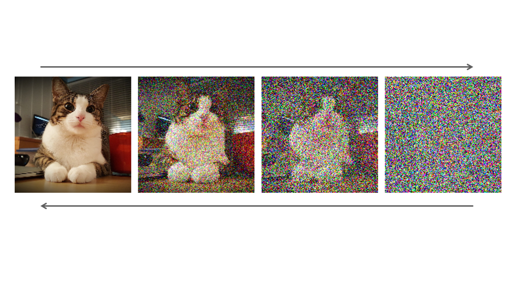

# Diffusion Mechanism

<figure>

<figcaption style="text-align: center">Figure 1: Generation Examples</figcaption>
</figure>

**What is diffusion ?**

Diffusion is a mechanism where the ultimate goal is to generate the beautiful images you see above. Of course the mechanism is not only used to generate images, with proper formulation diffusion models can approximate any type of data distribution.

Diffusion has two main processes:

* **Forward diffusion:** Gradually adds niose to the input
* **Reverse denoising:** Learns to generate the data with denoising
<figure>

<figcaption style="text-align: center">Figure 2: Diffusion Process Overview</figcaption>
</figure>

   

**Theoretical Backgorund**

You can view diffusion as following. The main goal is to convert complex distribution into a simpler target distribution by means of transition kernel T.

x0 ~ pcomplex ==> T(x0) ~ pprior

This kernels are modeled as repeated actions in diffusion. As you can see from the Figure 2, at each timestep *ti* model iteratively denoises the input. Thus at each timestep approaching to the target input distribution. How can we show that mathematically ?

$p_{prior}(x) = \int q(x|x') p_ {prior}(x')dx'$

If transition kernel q has the above property, then repeatedly applying this kernel leads samples towards $p_{prior}$.

<figure>

<figcaption style="text-align: center">Figure 3: Diffusion Over Time</figcaption>
</figure>

However we are able to do this operation in discrete timesteps.

$x_t \sim  q(x|x'= x_{t-1} ), \forall t>0$

*t* is finite and typically sufficent in practive.

Because transition kernel is repeatedly applied we can see overall process as Markov chain.

$q(X_t|X_{t-1}) = N(x_t; \sqrt{1-\beta_t} x_{t-1}, \beta_t I) $

$q(X_T) = p_{prior}(X_T) = N(x_t; 0, I) $

To be able to generate the data, we need reverse diffusion process. 

$x_T \sim N(0,1) \to T^{-1}(x_T) \sim p_{data}$

Process $T^{-1}$ learns from the data

<figure>

<figcaption style="text-align: center">Figure 4: Forward and Backward Diffusion</figcaption>
</figure>

## Forward Diffusion Process

Forward diffusion process is fixed. Starting from data $x_0$, forward diffusion process adds noise to the data with variance $\beta_t$ 

$q(X_t|X_{t-1}) = N(x_t; \sqrt{1-\beta_t} x_{t-1}, \beta_t I) \to q(x_{1:T}|x_0)=\prod_{t=1}q(X_t|x_{t-1})$ 

Using Gaussian's linearity over *t*, we can directly express $q(x_t|x_0)$ as a shortcut. We do not need to sample iteratively in forward process. Thus we can furhter speed up the training process.

Define $ \bar{\alpha_t} = \prod_{s=1}^t(1-\beta_s) \to q(x_t|x_0) = N(x_t;\sqrt{\bar{\alpha}_t}x_0, (1-\bar{\alpha}_t)I))$

Sample: 
$ x_t = \sqrt{\bar{\alpha}_t}x_0+\sqrt{(1-\bar{\alpha}_t)}\epsilon$ where $\epsilon \sim N(0,1)$

Because we can obtain $x_t$ from the $x_0$ the forward process is much faster this way.

 

**How are $\beta_t$ values choosen ?**

There are multiple approaches that one can follow. Some of them are as following:

* Linearly schedule $\beta$ values from $\beta_1=10^{-4}$ to $\beta_T=0.02$ [Denoising Diffusion Probabilistic Models
](https://arxiv.org/abs/2006.11239)
* Learn $\beta$ values together with the model [Sohl-Dickstein, Jascha, et al. "Deep unsupervised learning using nonequilibrium thermodynamics." International conference on machine learning. PMLR, 2015.](https://proceedings.mlr.press/v37/sohl-dickstein15.html).

**What happens during forward diffusion process ?**

$q(x_T) = \int q(x_0, x_t) = \int q(x_0) q(x_t | x_0) dx_0$

We can sample $x_t \sim q(x_t)$ by first sampling $x_0 \sim q(x_0)$ and then sampling $x_t \sim q(x_t | x_0)$
q  in the $x_t \sim q(x_t | x_0)$ is the transition kernel.

## Backward Diffusion

At this step the main goal is to denoise the $x_t$ so that at each time step we iteratively denoise the $x_t$ a bit. At the end, we will get rid of the noise and reach to original data $x_0$

$p(x_T)=N(x_T;0,I)$

$p_\theta(X_{t-1}|x_t)=N(x_{t-1};\mu_\theta(x_t,t),\sigma^2_t I) \to p_\theta(x_{0:T}) = p(X_T) \prod_{t=1}^Tp_{\theta}(x_{t-1}|x_t)$ 

$\mu_\theta \to$ is a trainable network to estimate $p(x_{t-1}|x_t)$ This can be U-net like model or denoising autoencoder etc. 

! One important point to note is that network is shared across all time steps. So takes *t* (time step) as input as well.

! As you recall $ \bar{\alpha_t}$ is defined as follows.: $ \bar{\alpha_t} = \prod_{s=1}^t(1-\beta_s)$. Because $\beta$ values can be predefined and learned troughout the training, $ \bar{\alpha_t}$ can be fixed or can be learned as well.

